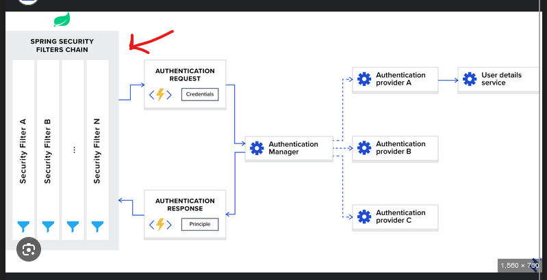

backend for the assessment, written in spring boot.
high chance won't be able to finish on time, but oh well 
life is really unfair.

So to keep a little summary of what ive done here is:

1. crud app with (some) APIs implemented. The general idea is U can start at the controller, and keep going deeper to see its implementation.
2. Since i don't have active GCP trials anymore, I couldnt get it to deploy, otherwise, a docker image is straightforward to build 
3. Speaking of the docker image, it has 2 things, the executable `.jar` file and a `starter.sh` that runs that app
4. i do have implemented a custom security stuff written entirely from scratch that leverages spring security. i will explain it in a different section

## THE SECURITY STUFF

 `note: in my opionion the steps i have taken are purely for demonstration, in a enterprise setting many things are to be delegated to external providers. (or just use oauth my dudes)`
 
so basically how spring security works, it has a security context. that context holds:
<li>authorities</li>
<li>principals</li>

 

so in the source code, if u go to the `config` package and inside `auth` you will see `JwtRequestFilter`.
 
this filter is one of many filters that spring give u the flexibility to add before a request is filtered. so, while scanning incoming requests, all these filters are applied one by one (see `AuthSecurityConfig`)

 
1. in our case, the `JwtRequestFilter` takes the request, extracts the `Authorization` header to get the JWT.
2. delegates the extracted email to user details service layer that gets the user by email and based on provided role, sets the authorities. <b> this is done before the request is even processed by the controllers </b>

### a good example of authority-adding logic is if a user is Admin, add both the roles of other types of users to it.

3. now, take a look at `authUtils` where ive written some functions to extract current user in the security context; in other words the currently logged in user. (this is entirely based on the tokens and no sessions are stored)

Coming back to tokens, the generation is pretty much the most basic auth u can think about, 
taking the password, hashing / salting it, then comparing. if passed, a token is generated and returned as response. (see `commonAuthServiceImpl`)
 
the `application.yaml` pretty much explains the current environment variables and other configurations, including auth. the `create-drop` mode in ddl-auto denotes that spring will create all tables based on the entity configurations

entities are nothing but db tables. I did not spend any time thinking about data modelling and pretty much just went with the flow. (NEVER DO THIS)
